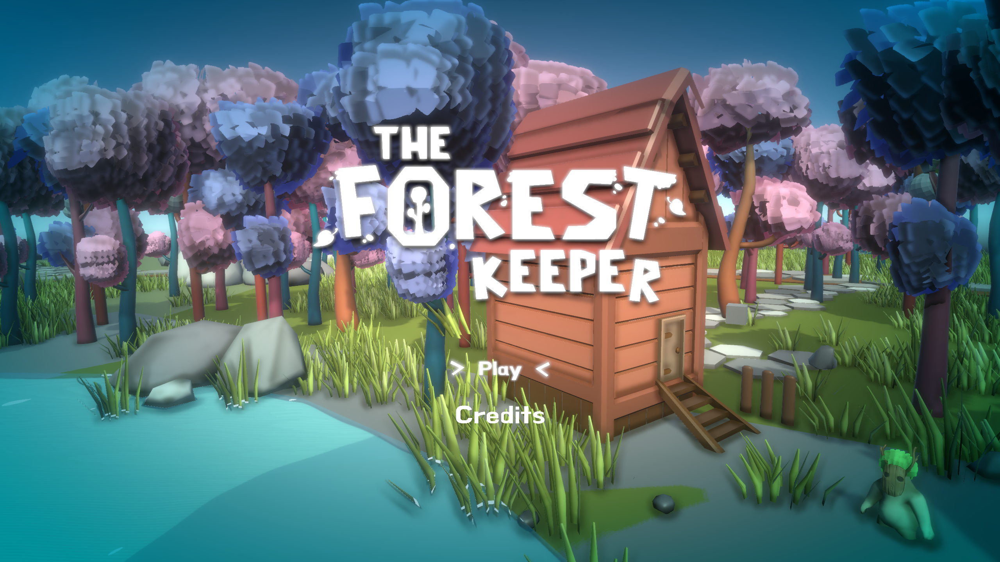
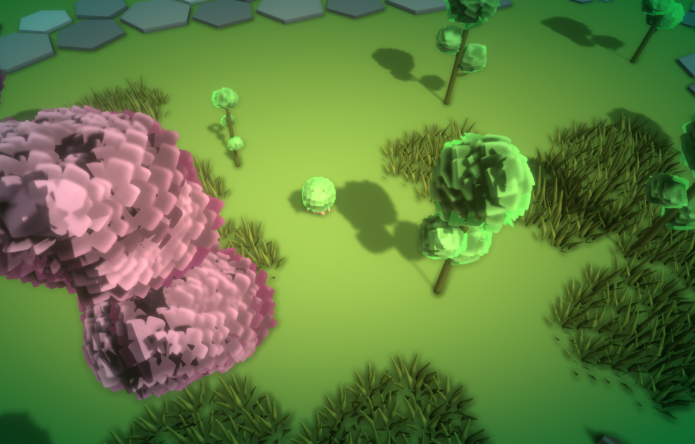
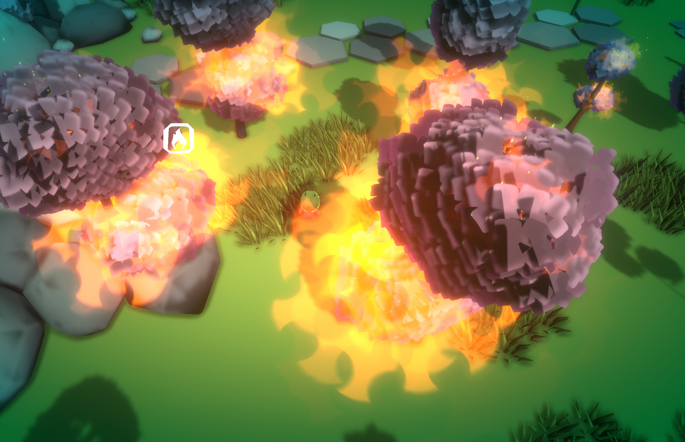

<html>
<link href="style.css" rel="stylesheet">

<h1 align="center"> The Forest Keeper</h1>

<h2> Introduction </h2>
The Forest Keeper is a game made on Unity 2020.3.15f2 at ISART DIGITAL. This project has been made in a week by the following group :

<h3> Designers </h3>

<b>
<ul>
    <li> Ahmadji Ursulet
    <li> Kylian Lombard
</ul>
</b>

<h3> Artists </h3>

<b>
<ul>
    <li> Maelyne Ayme
    <li> Emilie Hue
    <li> Manon Laberdure
    <li> Eva Martins
    <li> Hanna Mimouni
</ul>
</b>

<h3> Programmers </h3>

<b>
<ul>
    <li> Antoine Mordant
    <li> Bryan Bachelet
</ul>
</b>

<h3> Sound Designer </h3>

<b>
<ul>
    <li> Arthur Waligorski
</ul>
</b>

<h2> Game </h2>

<h3><b> - GamePlay</b></h3>
The Forest Keeper is a 3D game in 3rd person. You'll see your character from above. It's made to be played with a game controller.

<h3><b> - Pitch</b></h3>

You play the forest keeper, a tiny spirit, and your job is to manage your forest and keep it safe from danger. You will have to fight against the fire which threatens your forest with your powers. Will you survive until the rain ?

<h2>Personal work</h2>

<h3>Self generating forest</h3>

I have worked on the forest generation system : my goal was to create a forest which will seems natural and will grow by itself. 
    So i made this self replicating tree. Each tree can create a forest by duplicating itself until there is no more space aroud him. The tree can only breed in a certain radius and if there is a certain amount of trees in this radius, it can't breed anymore. You could tell yourself that it will expend for ever but each tree has a lifetime and die at the end and when all the old trees die, the forest in occupied at reconquering the terrain it has lost. Thanks to that system, the forest grows in a seemingly natural and pretty way.

<h3>User Interface</h3>

I have managed the UI for this project through differents systems :

At first, i have designed a clock timer to allows the player to know in which period of the game he is. There are 4 period : Morning, when the forest grows without problems; Midday, fire appears and threatens the forest; Evening, the rain save the forest that remains and stop the fire and Night, the warden falls asleep through a peace period and the forest grows faster during that period. In the top left corner of the screen, the player has a clock which shows which period it is with tiny symbols.

I also implemented the usual player parameter UI such as the oxygen bar and the water bar.

Last but not least, I created a UI signal to show the player the nearest fire.

<h3>Player Controls</h3>

Lastly, i have managed the control of the player and the implementation of the different abilities that he/she has (sprint and water projection).
